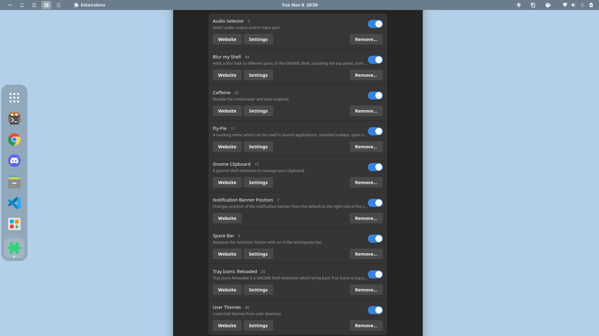

# Dotfiles & Configs Manjaro Gnome
## Description
My personal desktop setup on Manjaro Gnome, terminal, gnome extensions and other.

## Instalation
Clone the repository on your pc with

```bash
git clone https://github.com/EdzonAG/dotfiles-manjaro.git
```

Copy the files on your */home/usr/* directory, for the */usr* and */etc* directory copy in the */* route

## Desktop


### Gnome Extensions


